# 第3回 特別講義

### 本日のゴール
**C言語基礎：制御構造の正しい書き方を理解する**

---
### 本講義の進め方 - 体系的プログラミング学習
- 練習問題は講師とハンズオン形式で行っていきます
- 発展課題はご自身の力で行っていただきます
- 本日学習した内容を確認するテストを最後に行います

---
受講環境のセットアップ
**ステップ①** 前回講義で使用したご自身のGitHubリポジトリをクローンします
**ステップ②** 本講義で取組む課題やテストを記述していくフォルダ&ファイルを作成します

---

*※本講義で行う課題やテストの履歴は単位に関わる重要な評価軸になります*
*※本講義で資料で使用するソフトウェアと皆さんの実際に操作するソフトウェアでは一部見え方が異なる場合があります*
*※本講義は[こちらのサイト](https://9cguide.appspot.com/top.html)をベースに作成しています。*
*※資料の途中に参考資料が多々貼り付けてあります。各章ごとの要点がまとめられています。*

---

## GitHubリポジトリ準備

---
①VScodeを立ち上げます
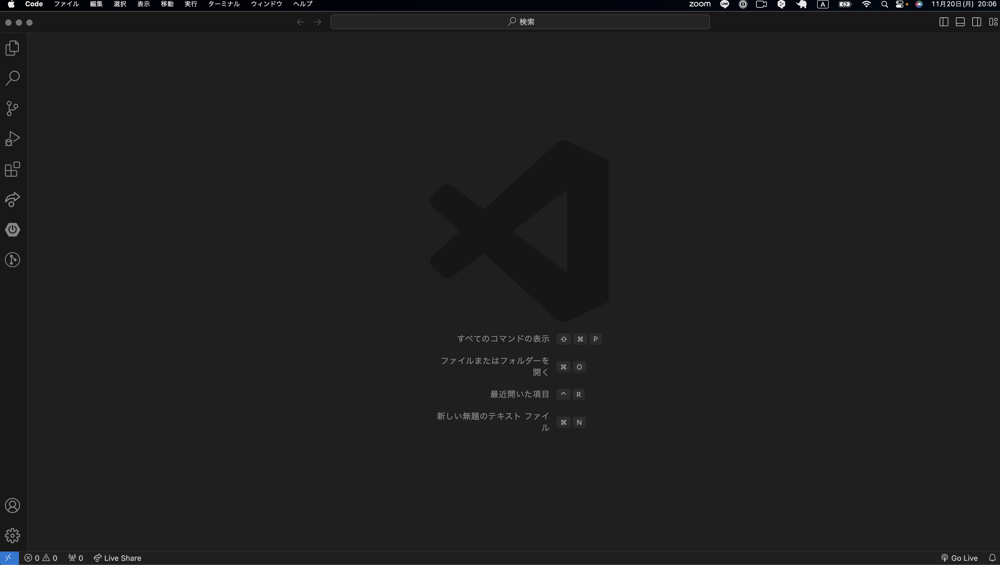

---
②上部メニューバーから『ターミナル』を選択し、<font color="red">新しいターミナル</font>を選択します
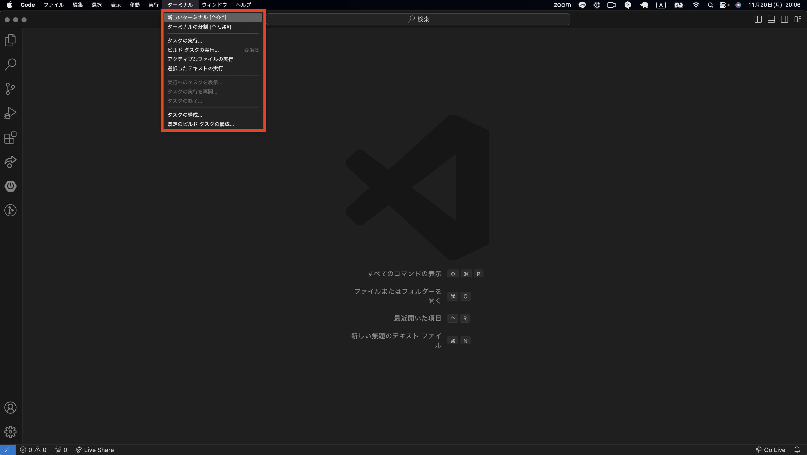

---
③VScode下部にターミナルが立ち上がることを確認してください
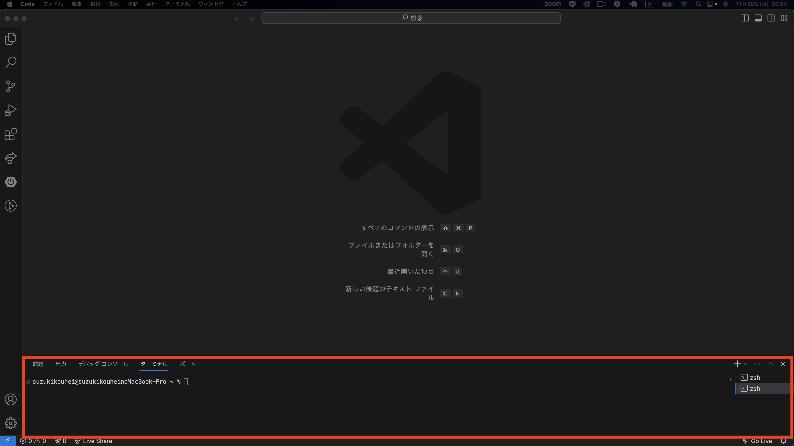

---
④C言語講義で使用するプロジェクトが保存されているご自身のディレクトリにコマンドラインで移動します。例：<font color="red">cd Document</font>と入力しEnter
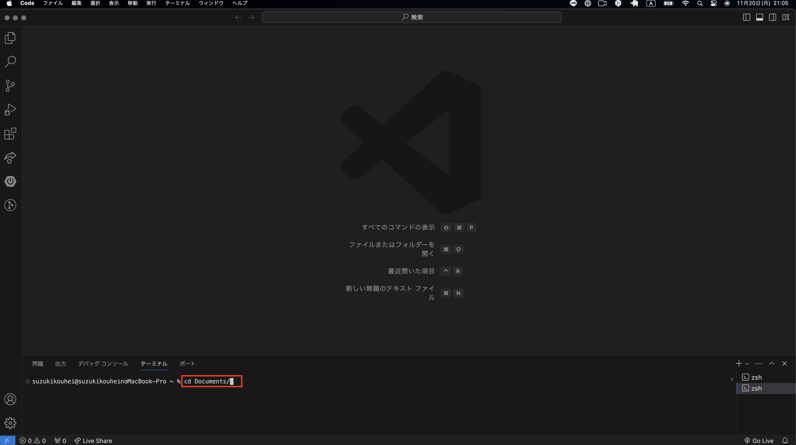

---
⑤プロジェクトが保存されている親ディレクトリで<font color="red">ls</font>と入力しEnterを押します。
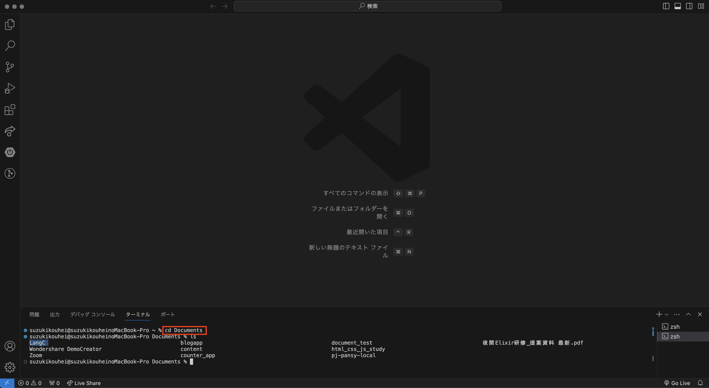

---
⑥LangC(本講義ディレクトリ名)ディレクトリに移動します。<font color="red">cd LangC</font>と入力しEnterを押します。
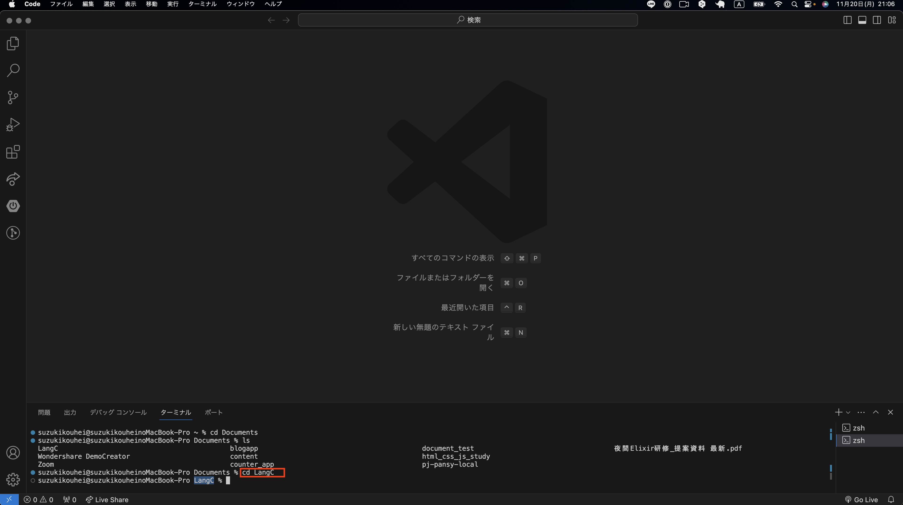

---
⑦LangCディレクトリに移動できたら<font color="red">code .</font>と入力しEnterを押します。これでLangCディレクトでVScodeを立ち上げることができます。
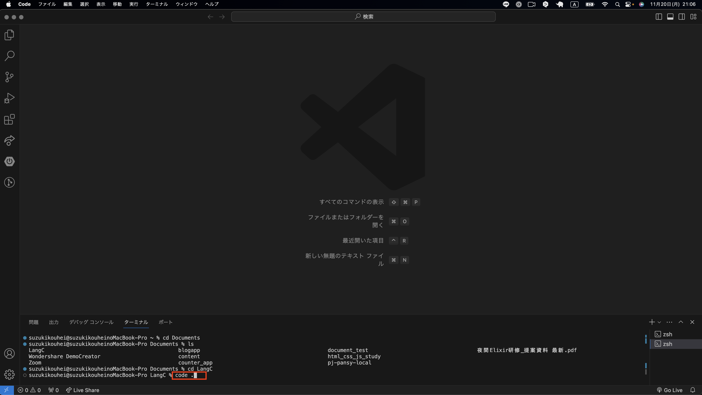

---
⑧新たにVScodeが立ち上がったら、元々操作していたVScodeは閉じましょう。
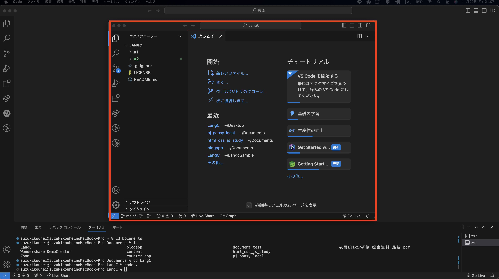

---
⑨新たにターミナルを立ち上げ、ターミナル上で<font color="red">git branch</font>と入力しEnterを押します。おそらく<font color="lime">main</font>または<font color="lime">master</font>と表示されます。

#### 補足
<font color="red">git branch</font>コマンドはGitで使用されるブランチ（プロジェクトの異なるバージョンや機能を管理するための枝分かれ）を操作するためのコマンドです。
<font color="red">git branch</font>コマンドを実行すると、リポジトリ内の全てのブランチが一覧で表示されます。
今回はbranchが<font color="lime">main</font>もしくは<font color="lime">master</font>のどちらかなのでそれ以外のbranchないことが予想されます。

---

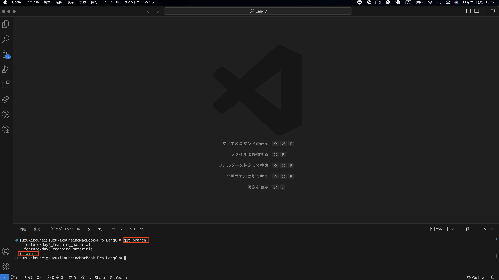

---
⑩次に、<font color="red">git pull</font>コマンドを入力しEnterを押します。
#### 補足
<font color="red">git pull</font>コマンドは、リモートリポジトリから最新の変更を取得し、それを現在のローカルリポジトリ（自分のコンピュータ上のプロジェクト）に統合するために使用されるGitコマンドです。

今回はリモートとローカルで変更がなかったため<font color="red">Already up to date.</font>（すでに最新です）と表示されました。仮に変更があった場合は、何らかの処理が表示されるものと覚えておきましょう。

---

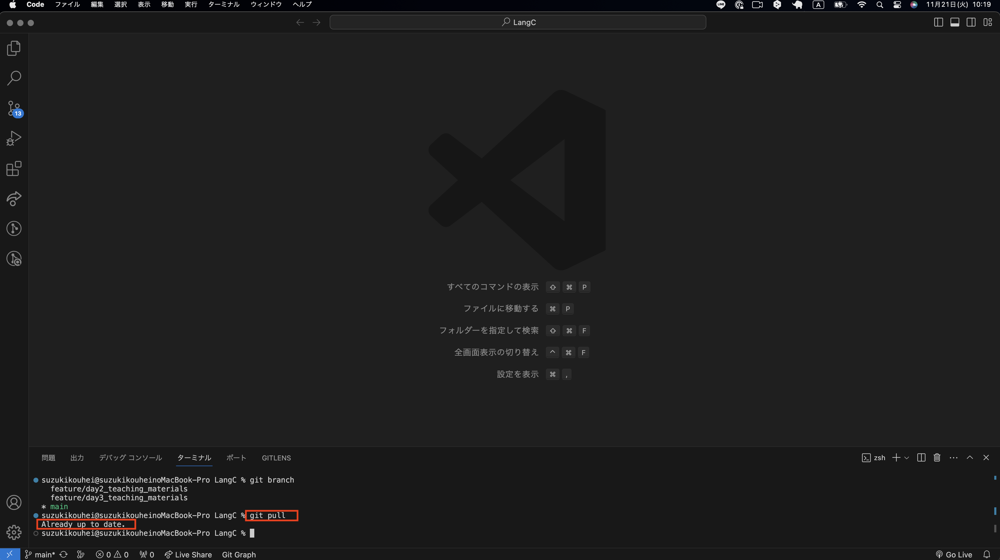

---
⑪新しいフォルダを作成しましょう。フォルダのアイコンを選択し、フォルダ名を **#3** (第3回目講義の意)としましょう。
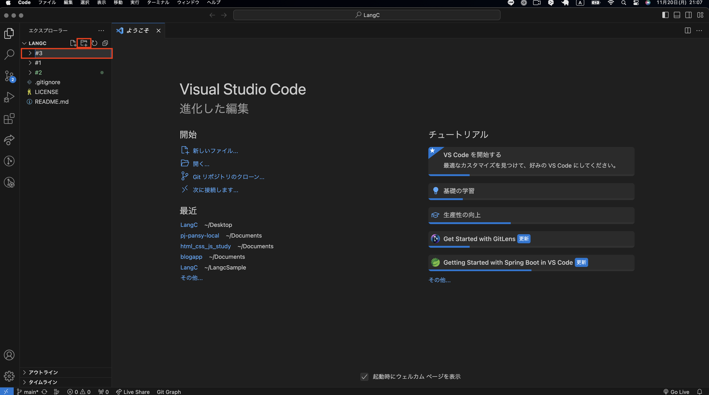

---
ここまでで、GitHubリポジトリの準備が完了できました。
これより、C言語学習に取組んでいただきます。

---
## 制御構造

本日はプログラムにおいて、非常に重要な制御構造について学んでいきます。

#### 制御構造とは
- プログラムの実行フロー（処理の流れ）を制御するための命令群です。
- 制御処理を行うプログラムの基本は、if文、for文、while文などが挙げられます。

**本日は、if文、for文、while文を中心に学習していきます。**

---
## if文：条件に基づいて異なる処理

---
前回の講義ではプログラムを使っての計算処理など一方通行のプログラミング処理を行いました。
つまり、始めから終わりまで、書かれている順番通りに文を実行し、文がなくなれば終わりになると言う、もっとも単純な仕組みでした。

---
**しかし、処理の条件がわかれていた場合、一方通行のプログラムではどちらの条件の処理を実行したらいいかがわかりません。**

**そんな時に、使うのがif文です。**

---
#### if文基本文法
以下はif文の基本文法です。ifの後に、条件に当てはまれば{}内の処理を行うという処理構造です。
```c
if (条件式)

{

  （条件式が成立する場合の処理を記述）

}
```
if文では、主に以下の３つを使い分けてプログラムを構成していきます。
- ### <font color="red">if</font> : 条件が真のときに実行されるコード
- ### <font color="red">else if</font>:複数の条件を順に評価するコード(複数使用可)
- ### <font color="red">else</font>:すべての条件が偽のときに実行されるコード

---
では、早速手を動かしていきましょう！

まずは、`#3`ディレクトリに`if_study.c`ファイルを作成し、下記の条件のプログラムを作成していきましょう。
```
・条件が１ ならば 牛丼温玉乗せ
・条件が２ ならば 豚丼
・どの条件にも当てはまらなければ 昼食抜き
```
```c
#include <stdio.h>

int main() {
    if (1) {
        printf("牛丼温玉乗せ\n");
     } else if(1) {
        printf("豚丼\n");
     } else {  
        printf("昼食抜き\n");
     }
     return 0;
}
```
---
色々なパターンを試しながら、どんなパターンならコンパイルや実行ができるのか、
それともできないのかを検証しましょう。

---
#### 練習課題：ハンズオン形式
①ifを０にする
```c
#include <stdio.h>

int main() {
    if (0) {
        printf("牛丼温玉乗せ\n");
     } else if(1) {
        printf("豚丼\n");
     } else {  
        printf("昼食抜き\n");
     }
     return 0;
}
```

---
②ifを2、else ifを1にする
```c
#include <stdio.h>

int main() {
    if (2) {
        printf("牛丼温玉乗せ\n");
     } else if(1) {
        printf("豚丼\n");
     } else {  
        printf("昼食抜き\n");
     }
     return 0;
}
```
---
③ifの条件式をtrueに変更しましょう
```c
#include <stdio.h>

int main() {
    if (true) {
        printf("牛丼温玉乗せ\n");
     } else if(1) {
        printf("豚丼\n");
     } else {  
        printf("昼食抜き\n");
     }
     return 0;
}
```

---
④ifを-1にする
```c
#include <stdio.h>

int main() {
    if (-1) {
        printf("牛丼温玉乗せ\n");
     } else if(1) {
        printf("豚丼\n");
     } else {  
        printf("昼食抜き\n");
     }
     return 0;
}
```
---
⑤if,else ifをどちらも０にする
```c
#include <stdio.h>

int main() {
    if (0) {
        printf("牛丼温玉乗せ\n");
     } else if(0) {
        printf("豚丼\n");
     } else {  
        printf("昼食抜き\n");
     }
     return 0;
}
```
---
⑦main関数をtest関数に変更しましょう
```c
#include <stdio.h>

int test() {
    if (0)
        printf("牛丼温玉乗せ\n");
     else  
        printf("豚丼\n");
    
    return 0;
}
```
---
⑧return関数を削除しましょう
```c
#include <stdio.h>

int main() {
    if (0) {
        printf("牛丼温玉乗せ\n");
     } else {  
        printf("豚丼\n");
     }
     return 0;
}
```
---
#### if文発展課題
- int型の変数aを定義し、６を代入します
- if文を定義し、条件式にaが5より小さければtrue(真)と定めます
- 処理内容として、「aは5より大きい」という文字列を出力します
```c
#include <stdio.h>

int main() {
    int a = 6;
    if (a > 5) {
        printf("aは5より大きい\n");
    }
    return 0;
}
```

---
#### if文チャレンジ問題
`変数 e が10より小さい場合に「eは10未満です」と出力するプログラムを書いてください。`
`if_test.c`ファイルを新たに作成してテストを行ってください。

※解答は講師解説、もしくはif_answer資料(別途配布)を確認してください。

---
#### ポイント
課題にある「未満」をどう判定するのかというと、プログラムでは比較演算子というものが使われます。比較演算子は左辺と右辺を比較するために用いられますが、さまざまな種類があるので頻繁に使用するものは覚えておくといいでしょう。

---
**基本的な演算子一覧**
| 演算子   |   説明   | 例 | 結果の説明 | 
|  :--:  | --------- | ------- |----------------------|
|   ==   |   等しい  | a == b|a が b と等しい場合に true|
|   !=   | 等しくない |a != b |a が b と等しくない場合に true|
|    >   | より大きい |a > b |a が b より大きい場合に true|
|    <   | より小さい |a < b |a が b より小さい場合に true|
|   >=   | 以上 |a >= b |a が b 以上の場合（a が b と等しいか、または <br>b より大きい場合）に true|
|   <=   | 以下 | a <= b|a が b 以下の場合（a が b と等しいか、または <br>b より小さい場合）に true|

---
## for文： 決められた回数だけ繰り返す処理

---
**for文はある一定の条件になるまで繰り返すことができるプログラムです。**
**ループとも言います。**

---
#### for文基本文法
以下はfor文の基本文法です。for文は一定回数繰り返しを行う場合に使用します。
for文の基本文法は次のようになっています。
```c
for (初期化; 条件式; 変化式) {
  実行する処理;
}
```
---
では、早速手を動かしていきましょう！

まずは、`#3`ディレクトリに`for_study.c`ファイルを作成し、下記の条件のプログラムを作成していきましょう。
```
・1~5までの数値を出力しましょう
```
```c
#include <stdio.h>

int main() {
    for(int i = 1; i < 5; i++) {
    printf("%d\n", i);
    }
return 0;
}
```
---
#### 練習課題：ハンズオン形式
①初期化部分の変数をaに変更する
```c
#include <stdio.h>

int main() {
    for(int a = 1; i < 5; i++) {
    printf("%d\n", i);
    }
return 0;
}
```
---
②条件式の変数もaに変更する
```c
#include <stdio.h>

int main() {
    for(int a = 1; a < 5; i++) {
    printf("%d\n", i);
    }
return 0;
}
```

---
③変化式部分の変数もaに変更する
```c
#include <stdio.h>

int main() {
    for(int a = 1; a < 5; a++) {
    printf("%d\n", i);
    }
return 0;
}
```

---
④実行内容部分の変数もaに変更する
```c
#include <stdio.h>

int main() {
    for(int a = 1; a < 5; a++) {
    printf("%d\n", a);
    }
return 0;
}
```

---
⑤実行処理部分の変数もaに変更する
```c
#include <stdio.h>

int main() {
    for(int a = 1; a < 5; a++) {
    printf("%d\n", a);
    }
return 0;
}
```

---
⑥for文内の{}(中括弧)を取り除く
```c
#include <stdio.h>

int main() {
    for(int a = 1; a < 5; a++)
    printf("%d\n", a);
return 0;
}
```

---
⑦\nを取り除く
```c
#include <stdio.h>

int main() {
    for(int a = 1; a < 5; a++) {
    printf("%d", a);
    }
return 0;
}
```

---
⑧{}（中括弧）を取り除いた状態で全て１行に書いてみる
```c
#include <stdio.h>

int main() {for(int a = 1; a < 5; a++)  printf("%d", a);return 0;}
```

---
#### for文発展課題
- 変数iを初期化してください
- 1~10までの整数が出力されるプログラムを作成してください
- 改行処理を組込んでください
```c
#include <stdio.h>

int main() {
    for (int i = 1; i <= 10; i++) {
        printf("%d\n", i);
    }
    return 0;
}

```
---
### fot文チャレンジ問題
`0~19までの整数を開業して出力されるプログラムを作成してください`
`for_test.c`ファイルを新たに作成してテストを行ってください。

※解答は講師解説、もしくはif_answer資料(別途配布)を確認してください。

---
## while文： 条件が満たされている間、繰り返します。

---
**while文は条件式を評価し真の間は繰り返し処理を行います。 for文とは異なり条件式で使われる変数の値をどのように変化させるかは指定していません。その為、実行される処理の中で別途記述する必要があります。**

---
#### while文基本文法
以下はwhile文の基本文法です。
- 単一の処理の場合
```c
while (条件式)
  実行する処理;
```
- 処理が複数ある場合
```c
while (条件式){
  実行する処理1;
  実行する処理2;
  実行する処理3;
  ....
}
```
---
では、早速手を動かしていきましょう！

まずは、`#3`ディレクトリに`while_study.c`ファイルを作成し、下記の条件のプログラムを作成していきましょう。
```
・1~10までの数値を出力しましょう
```
```c
#include <stdio.h>

int main() {
    int i = 1;
    while (i <= 10) {
        printf("%d\n", i);
        i++;
    }
    return 0;
}

```
---
#### 練習課題：ハンズオン形式
①比較演算子を<に変更しましょう
```c
#include <stdio.h>

int main() {
    int i = 1;
    while (i < 10) {
        printf("%d\n", i);
        i++;
    }
    return 0;
}
```

---
②全て１行に繋げましょう
```c
#include <stdio.h>

int main() {int i = 1;while (i <= 10) {printf("%d\n", i);i++;}return 0;}
```

---
③全てのセミコロン(;)を取り除きましょう
```c
#include <stdio.h>

int main() {
    int i = 1
    while (i <= 10) {
        printf("%d\n", i)
        i++
    }
    return 0
}
```

---
④%dを取り除きましょう
```c
#include <stdio.h>

int main() {
    int i = 1;
    while (i <= 10) {
        printf("\n", i);
        i++;
    }
    return 0;
}
```

---
⑤int関数をdouble関数に変更しましょう
```c
#include <stdio.h>

int main() {
    double i = 1;
    while (i <= 10) {
        printf("%d\n", i);
        i++;
    }
    return 0;
}
```

---
⑥条件式の数値を10から10.0に変更しましょう
```c
#include <stdio.h>

int main() {
    double i = 1;
    while (i <= 10.0) {
        printf("%d\n", i);
        i++;
    }
    return 0;
}
```

---
⑦%dを%fに変更しましょう
```c
#include <stdio.h>

int main() {
    double i = 1;
    while (i <= 10.0) {
        printf("%f\n", i);
        i++;
    }
    return 0;
}
```

---
⑧変数iの数値を-1に変更してみましょう
```c
#include <stdio.h>

int main() {
    double i = -1;
    while (i <= 10.0) {
        printf("%f\n", i);
        i++;
    }
    return 0;
}
```

---
#### while文発展課題①
- 変数countを初期化してください
- 1~10までの整数が出力されるプログラムを作成してください
- 改行処理を組込んでください
---
### while文チャレンジ問題
**1~10までの数字の中から偶数のみを出力するプログラムを作成してください。**
*上記発展課題の続きにプログラムを作成してください*
`while_test.c`ファイルを新たに作成してテストを行ってください。

※解答は講師解説、もしくはif_answer資料(別途配布)を確認してください。

---
## 総合テスト
`総合テストはif,for,whileを複合的に使い、プログラムを作成していただきます。`
`comprehensive_test.c`ファイルを新たに作成しテストを行ってください。

**1から50までの数字の中で、3で割り切れる数字を出力するプログラムを書いてください。ただし、出力は次のルールに従ってください**

- 1から25までは for ループを使う。
- 26から50までは while ループを使う。

---
### 提出方法　
**動画を参考にしながら、本日取組んだ課題やテストをGitHubリポジトリに提出してください**

<font color="red">本講義終了までに、ご自身のGitHubリポジトリにコミット&プッシュし、本日の課題とテストの結果を成果物として提出していただきます</font>